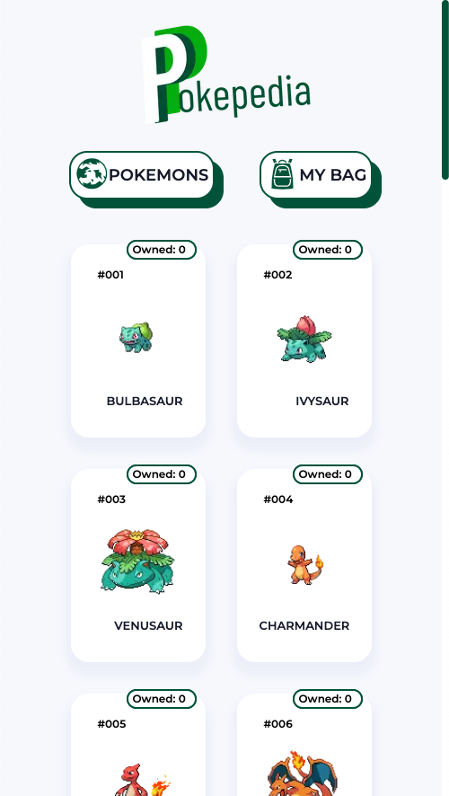
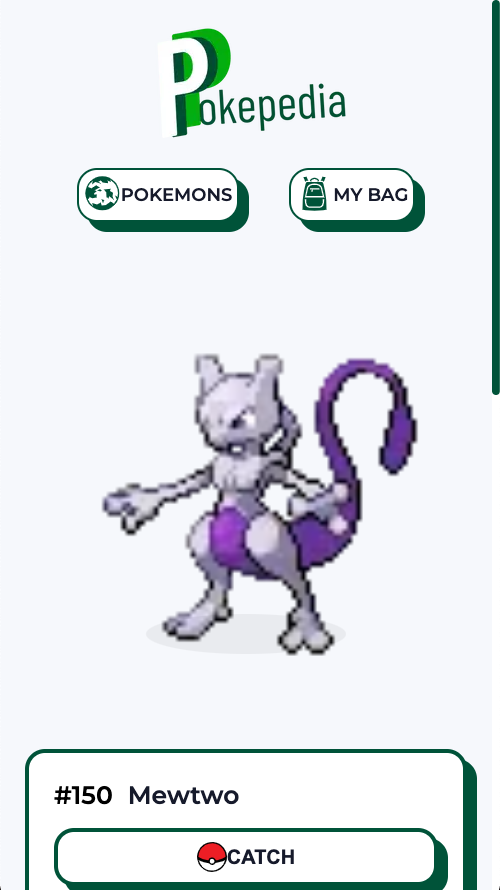
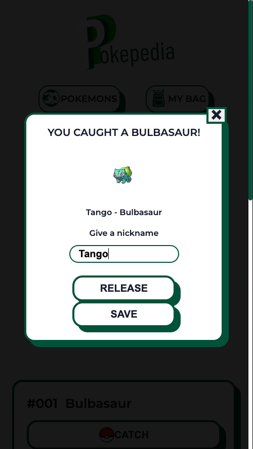
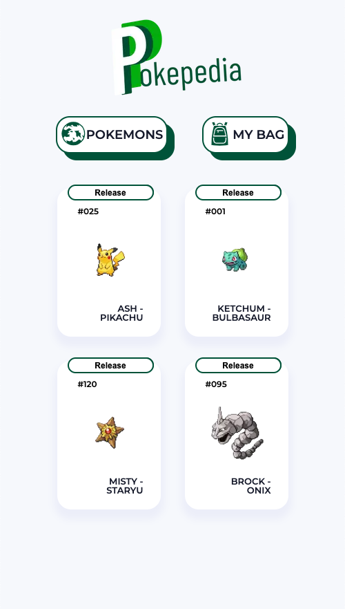

# Pokepedia


A pokedex web app built with Next.js.
Managed and distributed by Oak Pokémon Research Lab in Surabaya.

## Screenshots






## Run Locally

Clone the project

```bash
  git clone https://github.com/ewinggg/pokepedia
```

Go to the project directory

```bash
  cd pokepedia
```

Install dependencies

```bash
  npm install
```

Start the development server

```bash
  Open [http://localhost:3000](http://localhost:3000) with your browser to see the result.
```

## Running Tests

To run tests, run the following command

```bash
  npm test
```

## Built Using

- Create Next App 🧑‍💻 to initialize project.
- Emotion.sh 💄 CSS in JS.
- Apollo 🚀 Graphql Client.
- Jest & react testing-library 🔬 for testing.
- Written in Javascript 😌.
- Hosted on Vercel 🎊.

## License

[MIT](https://choosealicense.com/licenses/mit/)

Pokémon © 2002-2021 Pokémon. © 1995-2021 Nintendo/Creatures Inc./GAME FREAK inc. TM, ® and Pokémon character names are trademarks of Nintendo.
